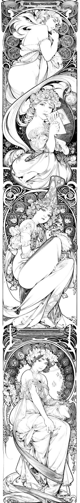

# infinite-mucha-esque-scroll

A machine printing Alphonse Mucha-eqsue picture scroll infinitely.

<p align="left">
  
</p>



## Prerequisites (image generation)

- [AUTOMATIC1111/stable-diffusion-webui](https://github.com/AUTOMATIC1111/stable-diffusion-webui) installation
  - Make sure your instance is launched with `--api` and/or `--listen` option. ([docs](https://github.com/AUTOMATIC1111/stable-diffusion-webui/wiki/Command-Line-Arguments-and-Settings))
  - Plugins
    - [Mikubill/sd-webui-controlnet](https://github.com/Mikubill/sd-webui-controlnet)
  - SD Models
    - [AOM3](https://huggingface.co/WarriorMama777/OrangeMixs)
    - [Counterfeit V2.5](https://huggingface.co/gsdf/Counterfeit-V2.5)
  - ControlNet models
    - canny (`control_canny-fp16 [e3fe7712]`)
  - LORAs
    - [Alphonse Mucha Arkstyle](https://civitai.com/models/13632/alphonse-mucha-arkstyle)
    - [Anime Lineart Style](https://civitai.com/models/16014/anime-lineart-style)
- Python 3.9
- poetry

```sh
$ poetry install --sync
$ poetry run imes --help
Usage: ...

# Generate a seed image
$ export WEBUI_SERVER=http://your.server:7860
$ mkdir output && cd output
$ poetry run imes -s $WEBUI_SERVER -o img_0.png -oP img_0_print.png

# Generate a continuous image
$ poetry run imes -s $WEBUI_SERVER -i img_0.png -o full.png -oO img_1_overlap.png -oN img_1.png -oP img_1_print.png

# And so on
$ seq 1 10 | xargs -I% -P1 bash -c 'IN=img_%.png; OUT=img_$((%+1)); poetry run imes -s $WEBUI_SERVER -i $IN -oN ${OUT}.png -oP ${OUT}_print.png'

# Join the images for previewing
$ convert -append $(ls img_*print.png | sort -V) full.png
```

## How it works

TLDR; This script does "Out-painting" with the ControlNet canny model to generate continuous images.

WIP.
